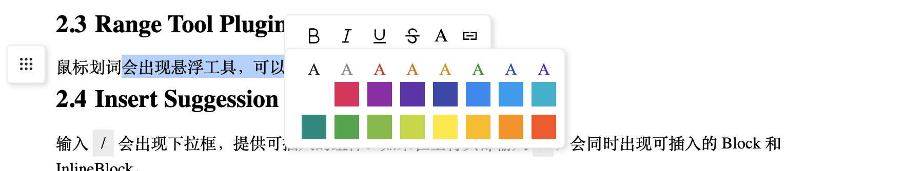

<div style="text-align: center;padding: 10px;margin-bottom: 50px;">
  
  <div id="badges">
    
    
    
    
    
    
    <a href="https://github.com/minditor/minditor">
      
    </a>
  </div>
  <div id="languages">
    <a href="/README.md">English</a>
    <a href="/README-zh_CN.md">中文</a>
  </div>
</div>

# 1. Minditor 是什么
Minditor 是一个既注重最终用户编辑体验，又注重开发者体验的块级富文本编辑器。它有以下特点：

- 已经提供了例如图片上传、markdown 命令等重要的组件和 Plugin，并将由官方持续完善，目标默认就提供达到专业编辑工具的用户体验。
- 支持 InlineBlock，可在行内插入。
- 可以用任何框架的组件来实现编辑器的 Block/InlineBlock。
- 除了常见的事件和 API 外， Plugin 系统还为开发者默认提供一系列重要的 reactive state，让开发 Plugin 变得无比简单。

我们的[官网首页](https://minditor.dev) 就是用 Minditor 编写和渲染的，你可以在首页上体验所有的功能，快去看看吧。

<div>

</div>

# 2. 编辑
## 2.1 Copy/Paste/Cut/Redo/Undo
默认支持右键菜单和快捷键进行复制、粘贴、剪切、撤回、重做。

## 2.2 markdown commands
Minditor 默认提供了以下命令来实现快速编辑：
- 输入 `# + 空格` 来插入 Heading。# 的数量决定了 Heading 的层级 
- 输入 `1. + 空格`来在 Heading 中插入自动序号。
- 在段首输入 `- + 空格` 插入无序列表。
- 在段首落输入 `1. + 空格`插入有序列表。
- 输入 `` + 加任意文字 + `` 插入 Inline Code。
- 在段首输入 ` ``` + 语言 + 空格` 插入代码编辑器。

## 2.3 Range Tool Plugin
鼠标划词会出现悬浮工具，可以修改字体样式或者创建链接。
<div>

</div>

## 2.4 Insert Suggestion Plugin
输入 `/` 会出现下拉框，提供可插入的组件。如果在空行头部输入 `/`，会同时出现可插入的 Block 和 InlineBlock。
<div>

</div>

## 2.5 Block Tool Plugin
鼠标移动到任意 Block，左侧会出现悬浮工具，默认提供删除、复制、黏贴和可插入 Block 等工具。

## 2.6 Table of contents Plugin
支持在文档外部显示由 Heading 构成的大纲。如本文档左侧所示。

## 2.7 Image Block
Minditor 的图片组件允许用户将图片上传到指定接口或者 aws3 bucket，也可以将图片使用 URL.createObjectURL 编码后直接保存到文档中。Minditor 中已经默认提供了将图片编码保存到文档中的组件 InlineImageBlock。
<div>

</div>
你也可以自己使用 createImageBlock 传入相应参数来创建将图片上传到指定地址的组件：

```typescript
import {createImageBlock} from 'minditor'
// @params
// - type: 'xhr'|'aws'
// - config: Uppy.XHRConfig|Uppy.AWS3Config
const ImageBlock = createImageBlock(
'xhr',
{endpoint: 'https://your-domain.com/upload'}
)
```
Image Block 中使用了 Uppy 作为上传的工具。更多地配置可以参考 [https://uppy.io/docs/xhr-upload/ ](https://uppy.io/docs/xhr-upload/ ) 。

## 2.8 Grid Block
Grid 组件的单元格中支持所有的文档能力，相当于一个内嵌的小文档。可以通过左侧的 Block Tool 在空段落处插入 Grid。也可以在段首输入 `/` 后 Insert Suggestion Plugin 中获得。Grid 支持的功能：
<div>

</div>

我们已经在开发一款更强大的 spreadsheet 工具，包含更强大的布局和数据处理能力，未来也会作为组件嵌入到 Minditor 中，所以当前的 Grid 没有太多的增强计划。

## 2.9 Code Block
Minditor 使用了 CodeMirror 6 作为 Code 组件。默认支持以下语言:

• javascript (alias js/jsx)
• typescript (alias ts/tsx)
• python
• php
• cpp
• java
• sql
• json
• rust
• css
• html
• sass
• less
• xml
• yaml

你可以通过在段首输入 ` ``` + 语言 + 空格` 来插入指定语言的 Code Block。也可以通过 Block Tool 或者 Suggession Tool 插入。

# 3. 开发
## 3.1 安装与初始化
```bash
npm i minditor
```
Minditor 本身的可以渲染在任意的 dom 节点中。对外没有任何的布局、样式等要求.
如果你只是用来渲染最简单的文字。可以直接使用下面的方式来渲染：
```typescript
import {
    Code,
    Grid,
    Heading,
    InlineImageBlock,
    InlineCode,
    Link,
    OLItem,
    Paragraph,
    Text,
    ULItem,
    InlineImageBlock
} from "minditor";

const rootElement = document.getElementById('root')!
const types = {
    Paragraph,
    Text,
    Heading,
    OLItem,
    ULItem,
    InlineCode,
    Code,
    Link,
    Grid,
    Image: InlineImageBlock
}
const data = {
    name: 'MyDoc',
    children: [{
        type: 'Paragraph',
        content: [{type:'Text', value: 'This is my first document.'}]
    }]
}

const doc = new Document(rootElement, data, types)
doc.render()
```

对于需要完整 Plugin，希望视图匡高自动适应外部 container 的场景，我们推荐使用 scaffold 来创建视图：

```typescript
import {
    Code,
    createBlockTool,
    createRangeTool,
    createSuggestionTool,
    defaultBlockWidgets,
    defaultFormatWidgets,
    defaultMarkdownPlugins,
    defaultSuggestionWidgets,
    Grid,
    Heading,
    InlineImageBlock,
    InlineCode,
    Link,
    OLItem,
    Paragraph,
    scaffold,
    Text,
    ULItem,
    createTOCTool
} from "minditor";

const root= document.getElementById('root')!
const types = {
    Paragraph,
    Text,
    Heading,
    OLItem,
    ULItem,
    InlineCode,
    Code,
    Link,
    Grid,
    Image: InlineImageBlock
}

const plugins = [
    ...defaultMarkdownPlugins,
    createBlockTool(defaultBlockWidgets),
    createRangeTool( defaultFormatWidgets ),
    createSuggestionTool(defaultSuggestionWidgets),
    createTOCTool()
]
const result = scaffold(root, {data: jsonData, types, plugins}, { debug: true })
result.render()
```

## 3.2 开发 InlineBlock
Inline可以嵌入到行内，开发一个 InlineBlock 非常简单，我们以 InlineCode 为例：
```typescript jsx
export class InlineCode extends InlineComponent {
    static displayName = 'InlineCode'
    constructor(public data: InlineCodeData) {
        super();
    }
    render()  {
        return <span style={{display:'inline-block', background:'#eee', padding:'4px 8px'}}>{this.data.value}</span>
    }
    toText() {
        return this.data.value
    }
}
```

通常有了 InlineBlock 之后，我们还需要为用户提供使用 InlineBlock 的方法。有两种方式：

1. 在 Minditor 的 SuggestionTool 中出一个 Widget，当用户输入 / 时将展开下拉框看见这个 Block，并能点击使用。
2. 实现一个 Plugin，监听用户的特殊输入，当输入满足条件时插入 InlineBlock。类似于 markdown。

我们在这里以添加字体颜色和背景色的 Widget 为例来看如何创建一个 Range Tool 的 Widget：
```typescript jsx
class ColorWidget extends RangeWidget {
    static displayName = `ColorRangeWidget`
    useColor = (color: string) => {
        this.document.view.formatCurrentRange({color})
    }
    useBackgroundColor = (backgroundColor: string) => {
        this.document.view.formatCurrentRange({backgroundColor})
    }

    render() {
        const hover = atom(false)

        const pickerStyle = () => {
            return ({
                display: hover() ? 'block' : 'none',
                position: 'absolute',
                top: '100%',
                left: 0,
                transform: 'translateX(-50%)',
            })
        }

        const picker = (
            <div style={pickerStyle}>
                <ColorPicker onColorClick={this.useColor} onBackgroundColorClick={this.useBackgroundColor}/>
            </div>
        )
        return (
            <div style={{display:'flex', position:'relative', width:24, height:24, alignItems: 'center',justifyContent: 'center'}}
                 onmouseenter={() => hover(true)}
                 onmouseleave={() => hover(false)}
            >
                <span style={{cursor: 'pointer',marginLeft:8, fontSize:18}}>A</span>
                {picker}
            </div>
        )
    }
}
```

有了这个 widget 之后，只要在 createRangeTool 的地方传入它即可使用：

```typescript jsx
const plugins = [
    //...  other plugins
    createRangeTool( [...defaultFormatWidgets, ColorWidget] ),
]
```

关于 Plugin 的开发下面有更详细的例子。
## 3.3 开发 Block
开发一个 Block Compnent 的方式与 Inline Component 基本相同。只是最后在提供给用户使用时，我们是将其注册到 BlockTool 或 Insert Suggession Tool 中供用户使用。注意 BlockTool 中的 Widget 和 Insert Suggession Tool 的  Widget 是通用的。为了进一步降低 Widget 的开发难度，minditor 还提供了 createSuggestionWidget 函数来帮助快速开发 widget，我们这里以插入 Code 的 Widget 为例：

```typescript jsx
type CommonInsertHandleProps = {
    insert: (initialData: InlineData|BlockData) => void
}

function CodeInsertHandle({insert}: CommonInsertHandleProps) {
    const onGridChange = (lang: string) => {
        insert({type: 'Code', language:lang, value: '', content: []})
        activated(false)
    }
    const activated = atom(false)

    const languages = Object.keys(CodeBlock.langToPlugin)

    return (
        <div
            style={{
                position: 'relative',
                display: 'flex',
                alignItems: 'center',
                justifyContent: 'flex-start',
                cursor: 'pointer',
                width: '100%'
            }}
            onmouseenter={() => activated(true)}
            onmouseleave={() => activated(false)}
        >
            <Code size={18}/>
            <span style={{marginLeft: 8, fontSize: 14,  whiteSpace:'nowrap'}}>+ Code</span>
            <Right size={18}/>

            <div style={() => ({
                display: activated() ? 'block' : 'none',
                position: 'absolute',
                left: 'calc(100% - 8px)',
                top: 0,
                transform: 'translateY(-50%)',
                paddingLeft: 18,
                background: 'transparent',
            })}
            >
                <div style={{
                    border: '1px solid #eee',
                    background: '#fff',
                    boxShadow: '2px 2px 5px #dedede',
                    maxHeight: 400,
                    overflowY: 'auto'
                }}
                >
                    <CodeLanguagePicker onChange={onGridChange} languages={languages}/>
                </div>
            </div>
        </div>
    )
} 

const CodeBlockWidget = createSuggestionWidget(CodeInsertHandle, 'Code', true)
```

### 3.3.1 使用 React 来开发 Block
我们以一个 Calendar 组件来演示如何使用其他框架来开发 Block.

```typescript jsx
import { Component } from 'minditor'
import { createElement } from 'react';
import { createRoot } from 'react-dom/client';

class Calendar extends Component {
    static displayName = 'Calendar'
    render() {
        const container = document.createElement('div')
        container.contentEditable = 'false'
        const root = createRoot(container);
        root.render(createElement(DayPicker, {mode: 'single'}));
        return container
    }
}
```

## 3.4 开发 Plugin
Minditor 中的 Plugin 拥有对整个 document 进行控制的能力，能实现几乎任何需求。它能实现根据用户的输入执行一次性的命令，也可以有自己的独立界面来支持更复杂的操作。

### 3.4.1 执行一次性命令
我们以 markdown 中添加 Heading 的能力为例来看如何开发 Plugin。

```typescript jsx
class Plugin extends Plugin{
  public static displayName = `createHeading`
  public static activateEvents = {
    inputChar: onInputKey(' ')
  }
  run({} : PluginRunArgv) : boolean | undefined{
    const initialCharacters = '#'
    const { view, history } = this.document
    const startRange = view.state.selectionRange()
    const { startText,  startBlock,  isEndFull,isCollapsed, endText } = startRange!
    //  1. Headings can only be generated within the content of a Para.
    if (!(startBlock instanceof Paragraph || startBlock instanceof Heading)) return false
    // 2. Can only at Para head.
    if (startBlock.firstChild !== startText) return false
    // 3. Text in startText should match #
    if (startText.data.value.slice(0, initialCharacters.length) !== initialCharacters) return false

    // 4. delete last space
    const textToMatch = startText.data.value.slice(0, startText.data.value.length - 1)
    const matchedText = reversMatchStr(textToMatch, initialCharacters)
    if (matchedText === false) return false

    // Start replacing
    history.openPacket(startRange)
    // 1. Delete initialCharacters and space in startText
    const newTextAfterCursor = startText.data.value.slice(initialCharacters.length + 1)
    view.updateText(newTextAfterCursor, startText)
    // 2. Get all text in the middle
    const titleTextFrag = view.deleteBetween(startText, null, startBlock)
    // 3. Replace with new Heading block
    const newBlock = createBlock.call(this, titleTextFrag)
    view.replace(newBlock, startBlock, this.document.content)
    view.setCursor(newBlock, 0)
    const endRange = new DocRange(newBlock, newBlock.firstChild!, 0, newBlock, newBlock.firstChild!, 0, )
    history.closePacket(endRange)
    return true
  }
}
```

### 3.4.2 渲染界面
Plugin 使用了一个轻量级、响应式的前端框架 Axii 来渲染 UI。开发者只需要简单记住以下基础用法即可：
- 需要相应的数据使用 `atom()` 包裹起来，用函数调用的形式取值赋值。
- 使用 `computed` 来包装计算数据。
- 需要保持 reactive 的 dom 结构/属性 使用函数来表示，无需 `computed` 包装。

我们以 Range Tool 为例，来看如何使用 Axii  和系统提供的 reactive state 构建响应式界面。
```typescript jsx
class OneRangeTool extends RangeTool {
    public rangeWidgets: RangeWidget[]

    constructor(public document: Document) {
        super(document);
        this.rangeWidgets = RangeWidgets.map(RangeWidgetClass => {
            return new RangeWidgetClass(this.document)
        })
    }
    calculatePosition(outsideDocBoundary: boolean) {
        const {visibleRangeRect, lastMouseUpPositionAfterRangeChange, selectionRange, hasRange} = this.document.view.state

        const positionAttrs = {
            position: 'fixed'
        } as any

        positionAttrs.position = 'fixed'
        // Decide modal position based on last mouse position
        if (lastMouseUpPositionAfterRangeChange()!.top > (visibleRangeRect.raw!.top + visibleRangeRect.raw!.height / 2)) {
            positionAttrs.top = visibleRangeRect.raw!.top + visibleRangeRect.raw!.height
            positionAttrs.bottom = undefined 
        } else {
            positionAttrs.top = undefined 
            positionAttrs.bottom = -(visibleRangeRect.raw!.top)
        }
        positionAttrs.left = lastMouseUpPositionAfterRangeChange()!.left

        // If the plugin UI is in same container with content, use 'absolute' position.
        if(!outsideDocBoundary) {
            const boundaryRect = this.document.view.getContainerBoundingRect()!
            positionAttrs.position = 'absolute'
            if (lastMouseUpPositionAfterRangeChange()!.top > (visibleRangeRect.raw!.top + visibleRangeRect.raw!.height / 2)) {
                positionAttrs.top -= boundaryRect.top
            } else {
                positionAttrs.bottom += boundaryRect.top
            }
            positionAttrs.left -= boundaryRect.left

        }
        return positionAttrs
    }
    render(outsideDocBoundary: boolean) {
        const style = () => {
            const { lastMouseUpPositionAfterRangeChange, hasRange} = this.document.view.state
            if (!lastMouseUpPositionAfterRangeChange() || !hasRange()){
                return {display: 'none'}
            }

            const positionAttrs = this.calculatePosition(outsideDocBoundary)

            return {
                display: 'block',
                ...positionAttrs,
            }
        }

        return <div style={style} data-testid="rangeTool-container">
            <div style={{display:'flex', whiteSpace: 'nowrap'}}>
                {() => this.rangeWidgets.map((widget: RangeWidget) => {
                    return widget.render()
                })}
            </div>
        </div>
    }
}
```

### 3.4.3 系统内置的 reactive state
系统默认提供的 Reactive State 如下：
system provides the following built-in Reactive State:
- lastActiveDeviceType: 用户最后操作的设备，鼠标或键盘。
- lastMouseUpPositionAfterRangeChange: mouseup 事件最后出现的位置。
- mousePosition：当前鼠标位置。
- selectionRange：表示成 Minditor DocRange 类型的选区对象。
- hasRange：是否有选区。
- rangeBeforeComposition：输入法出现之前的选区。
- lastMouseEnteredBlock：最后触发 mouseenter 的 Block。
- visibleRangeRect：选区的 boundRect 对象。
- bodyViewPortSize：body 可视范围的尺寸。

# 4. Roadmap
## 4.1 AutoComplete Plugin
根据用户的上下文来支持自动补全，为接入 AI Copilot 提供基础。
## 4.2 File Upload Block
更多的文件上传和预览类型。

## 4.3 Data Table
支持可完整排序、筛选等功能的 Data Table。
## 4.4 Block level collaborative editing
块级的协同编辑，支持块级锁和单独授权。
## 4.5 More requests from community
我们欢迎用户提出更多 feature request。
# 5. Support
Minditor 目前由 [Zhenyu Hou](https://github.com/sskyy) 独立开发和维护。你的支持将用于雇佣开发者持续维护本项目和开发新的功能。Minditor 承诺所有支持支出均用于开发开源、免费、供社区所有人使用的功能。
通过 Patreon 支持本项目：[https://patreon.com/sskyy](https://patreon.com/sskyy) 。