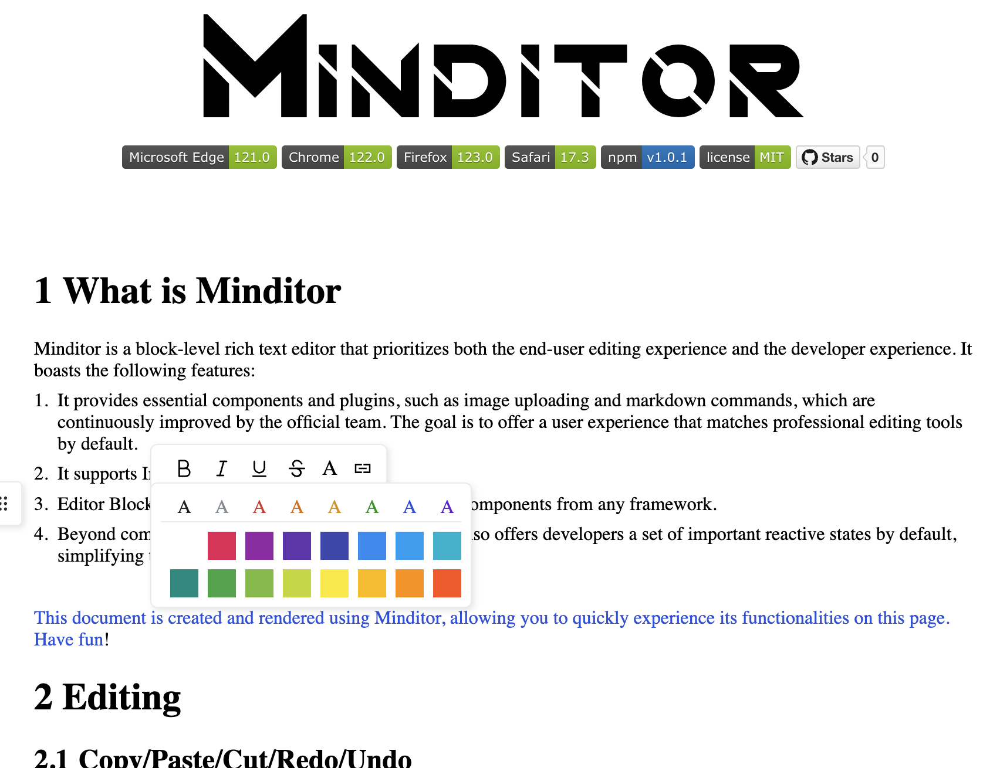
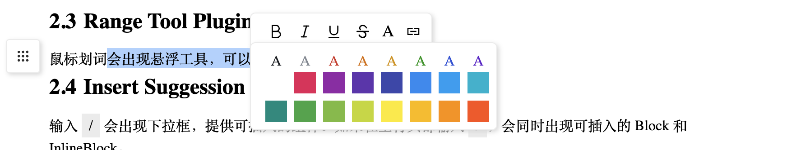
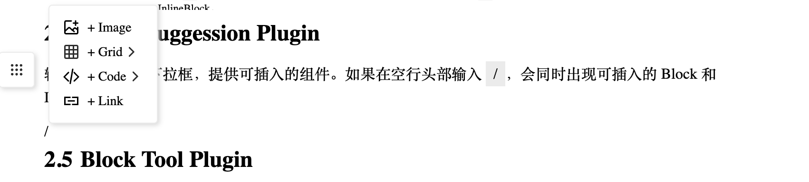
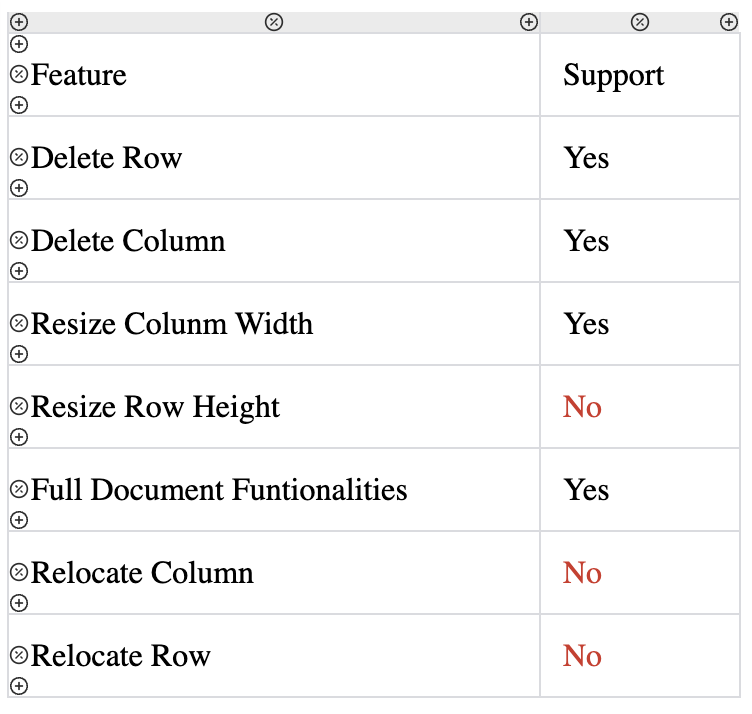

<div style="text-align: center;padding: 10px;margin-bottom: 50px;">
  
  <div id="badges">
    
    
    
    
    
    
    <a href="https://github.com/minditor/minditor">
      
    </a>
  </div>
  <div id="languages">
    <a href="/README.md">English</a>
    <a href="/README-zh_CN.md">中文</a>
  </div>
</div>

# 1. What is Minditor
Minditor is a block-level rich text editor that prioritizes both the end-user editing experience and the developer experience. It boasts the following features:

1. It provides essential components and plugins, such as image uploading and markdown commands, which are continuously improved by the official team. The goal is to offer a user experience that matches professional editing tools by default.
2. It supports InlineBlock for inline insertion.
3. Editor Blocks/InlineBlocks can be implemented with components from any framework.
4. Beyond common events and APIs, the Plugin system also offers developers a set of important reactive states by default, simplifying the development of Plugins.

Our [official website homepage](https://minditor.dev) is crafted and rendered using Minditor. You can experience almost all the features right on the homepage. Check it out.

<div>

</div>

# 2. Editing
## 2.1 Copy/Paste/Cut/Redo/Undo
By default, it supports right-click context menus and keyboard shortcuts for copy, paste, cut, undo, and redo.

## 2.2 markdown commands
Minditor provides the following commands for quick editing:
- Type # followed by a space to insert a Heading. The number of # symbols determines the level of the Heading. 
- Type 1. + [Space] within a Heading to insert an automatic numbering.
- Type - + [Space] at the beginning of a paragraph to insert an unordered list. 
- Type 1. + [Space]at the beginning of a paragraph to insert an ordered list.- Type ` + [ANY_CHARS] + ` to insert Inline Code.
- Type ``` + [Language Name] at  the beginning of a paragraph to  insert a code editor.
  Range Tool Plugin

## 2.3 Range Tool Plugin
Hovering over selected text with the mouse will display a floating toolbar, allowing you to change font styles or create links.
<div>

</div>

## 2.4 Insert Suggestion Plugin
Typing `/` will trigger a dropdown menu, offering components that can be inserted. If `/` is entered at the beginning of an empty line, both Blocks and InlineBlocks available for insertion will appear simultaneously.
<div>

</div>

## 2.5 Block Tool Plugin
Moving the mouse over any Block will display a floating toolbar on the left side, offering default tools for deletion, copying, pasting, and inserting Blocks.

## 2.6 Table of contents Plugin
Minditor supports displaying an outline composed of Headings outside the document, as shown on the left side of official website homepage.

## 2.7 Image Block
The image component in Minditor allows users to upload images to a specified interface or an AWS S3 bucket, or to save images directly into the document using URL.createObjectURL for encoding. Minditor already includes a default component, InlineImageBlock, for encoding and saving images into the document.
<div>

</div>
You can also use `createImageBlock` with the appropriate parameters to create a component that uploads images to a specified address:

```typescript
import {createImageBlock} from 'minditor'
// @params
// - type: 'xhr'|'aws'
// - config: Uppy.XHRConfig|Uppy.AWS3Config
const ImageBlock = createImageBlock(
'xhr',
{endpoint: 'https://your-domain.com/upload'}
)
```

The Image Block utilizes Uppy as the upload tool. For more configuration options, refer to [https://uppy.io/docs/xhr-upload/](https://uppy.io/docs/xhr-upload/).

## 2.8 Grid Block
The cells in the Grid block support all document capabilities, equivalent to an embedded mini-document. You can insert a Grid at an empty paragraph using the Block Tool on the left. It can also be obtained through the Insert Suggestion Plugin by typing '/' at the beginning of a paragraph. The features supported by Grid include:
<div>

</div>

We are currently developing a more powerful spreadsheet tool, which includes enhanced layout and data processing capabilities. This tool will also be integrated into Minditor as a component in the future, so there are no extensive enhancement plans for the current Grid.

## 2.9 Code Block
Minditor utilizes CodeMirror 6 for its Code component. By default, it supports the following languages:

• javascript (alias js/jsx)
• typescript (alias ts/tsx)
• python
• php
• cpp
• java
• sql
• json
• rust
• css
• html
• sass
• less
• xml
• yaml

You can insert a Code Block for a specific language by typing ` ``` + [Language Name]` at the beginning of a paragraph. It can also be inserted using the Block Tool or the Suggestion Tool.

# 3. Development
## 3.1 Installation and Initialization
```bash
npm i minditor
```
Minditor itself can be rendered in any DOM node without any external requirements for layout or style.
If you are using it to render the simplest text, you can render it directly using the following method:
```typescript
import {
    Code,
    Grid,
    Heading,
    InlineImageBlock,
    InlineCode,
    Link,
    OLItem,
    Paragraph,
    Text,
    ULItem,
    InlineImageBlock
} from "minditor";

const rootElement = document.getElementById('root')!
const types = {
    Paragraph,
    Text,
    Heading,
    OLItem,
    ULItem,
    InlineCode,
    Code,
    Link,
    Grid,
    Image: InlineImageBlock
}
const data = {
    name: 'MyDoc',
    children: [{
        type: 'Paragraph',
        content: [{type:'Text', value: 'This is my first document.'}]
    }]
}

const doc = new Document(rootElement, data, types)
doc.render()
```
For scenarios that require a complete Plugin and where the view's height automatically adapts to the external container, we recommend using `scaffold` to create the view:

```typescript

import {
    Code,
    createBlockTool,
    createRangeTool,
    createSuggestionTool,
    defaultBlockWidgets,
    defaultFormatWidgets,
    defaultMarkdownPlugins,
    defaultSuggestionWidgets,
    Grid,
    Heading,
    InlineImageBlock,
    InlineCode,
    Link,
    OLItem,
    Paragraph,
    scaffold,
    Text,
    ULItem,
    createTOCTool
} from "minditor";

const root= document.getElementById('root')!
const types = {
    Paragraph,
    Text,
    Heading,
    OLItem,
    ULItem,
    InlineCode,
    Code,
    Link,
    Grid,
    Image: InlineImageBlock
}

const plugins = [
    ...defaultMarkdownPlugins,
    createBlockTool(defaultBlockWidgets),
    createRangeTool( defaultFormatWidgets ),
    createSuggestionTool(defaultSuggestionWidgets),
    createTOCTool()
]
const result = scaffold(root, {data: jsonData, types, plugins}, { debug: true })
result.render()
```

## 3.2 Developing InlineBlock
InlineBlock can be embedded inline, and developing an InlineBlock is quite straightforward. Let's take InlineCode as an example:
```typescript jsx
export class InlineCode extends InlineComponent {
    static displayName = 'InlineCode'
    constructor(public data: InlineCodeData) {
        super();
    }
    render()  {
        return <span style={{display:'inline-block', background:'#eee', padding:'4px 8px'}}>{this.data.value}</span>
    }
    toText() {
        return this.data.value
    }
}
```

After having an InlineBlock, it's necessary to provide users with methods to use it. There are three ways:

1. Display a Widget in Minditor's SuggestionTool. When the user types `/`, a dropdown menu will appear showing this Block, which they can click to use.
2. Implement a Plugin that listens for specific user inputs and inserts an InlineBlock when the input meets certain conditions, similar to markdown.

As an example, let's see how to create a Widget for a Range Tool that adds font color and background color:
```typescript jsx
class ColorWidget extends RangeWidget {
    static displayName = `ColorRangeWidget`
    useColor = (color: string) => {
        this.document.view.formatCurrentRange({color})
    }
    useBackgroundColor = (backgroundColor: string) => {
        this.document.view.formatCurrentRange({backgroundColor})
    }

    render() {
        const hover = atom(false)

        const pickerStyle = () => {
            return ({
                display: hover() ? 'block' : 'none',
                position: 'absolute',
                top: '100%',
                left: 0,
                transform: 'translateX(-50%)',
            })
        }

        const picker = (
            <div style={pickerStyle}>
                <ColorPicker onColorClick={this.useColor} onBackgroundColorClick={this.useBackgroundColor}/>
            </div>
        )
        return (
            <div style={{display:'flex', position:'relative', width:24, height:24, alignItems: 'center',justifyContent: 'center'}}
                 onmouseenter={() => hover(true)}
                 onmouseleave={() => hover(false)}
            >
                <span style={{cursor: 'pointer',marginLeft:8, fontSize:18}}>A</span>
                {picker}
            </div>
        )
    }
}
```

With this widget in place, you can use it by passing it into the createRangeTool function:

```typescript jsx
const plugins = [
    //...  other plugins
    createRangeTool( [...defaultFormatWidgets, ColorWidget] ),
]
```
For the development of Plugins, more detailed examples are provided below.
## 3.3 Developing Block
Developing a Block Component is fundamentally similar to developing an Inline Component. The difference is in how it's made available for user use; it is registered within the BlockTool or Insert Suggestion Tool for user access. Note that Widgets in the BlockTool and those in the Insert Suggestion Tool are interchangeable. To further simplify the development of Widgets, Minditor provides a `createSuggestionWidget` function to assist in rapid widget development. Here, we take the insertion of a Code Widget as an example:

```typescript jsx
type CommonInsertHandleProps = {
    insert: (initialData: InlineData|BlockData) => void
}

function CodeInsertHandle({insert}: CommonInsertHandleProps) {
    const onGridChange = (lang: string) => {
        insert({type: 'Code', language:lang, value: '', content: []})
        activated(false)
    }
    const activated = atom(false)

    const languages = Object.keys(CodeBlock.langToPlugin)

    return (
        <div
            style={{
                position: 'relative',
                display: 'flex',
                alignItems: 'center',
                justifyContent: 'flex-start',
                cursor: 'pointer',
                width: '100%'
            }}
            onmouseenter={() => activated(true)}
            onmouseleave={() => activated(false)}
        >
            <Code size={18}/>
            <span style={{marginLeft: 8, fontSize: 14,  whiteSpace:'nowrap'}}>+ Code</span>
            <Right size={18}/>

            <div style={() => ({
                display: activated() ? 'block' : 'none',
                position: 'absolute',
                left: 'calc(100% - 8px)',
                top: 0,
                transform: 'translateY(-50%)',
                paddingLeft: 18,
                background: 'transparent',
            })}
            >
                <div style={{
                    border: '1px solid #eee',
                    background: '#fff',
                    boxShadow: '2px 2px 5px #dedede',
                    maxHeight: 400,
                    overflowY: 'auto'
                }}
                >
                    <CodeLanguagePicker onChange={onGridChange} languages={languages}/>
                </div>
            </div>
        </div>
    )
} 

const CodeBlockWidget = createSuggestionWidget(CodeInsertHandle, 'Code', true)
```

### 3.3.1 Developing Block with React
We will demonstrate how to develop a Block using React to create a Calendar block as example.

```typescript jsx
import { Component } from 'minditor'
import { createElement } from 'react';
import { createRoot } from 'react-dom/client';

class Calendar extends Component {
    static displayName = 'Calendar'
    render() {
        const container = document.createElement('div')
        container.contentEditable = 'false'
        const root = createRoot(container);
        root.render(createElement(DayPicker, {mode: 'single'}));
        return container
    }
}
```

## 3.4 Developing Plugin
In Minditor, a Plugin has the capability to control the entire document, allowing for the fulfillment of nearly any requirement. It can execute one-time commands based on user input, and also possesses its own independent interface to support more complex operations.

### 3.4.1 Execute One-time Commands
Let's take the ability to add Headings in markdown as an example to see how to develop a Plugin.

```typescript jsx
class Plugin extends Plugin{
  public static displayName = `createHeading`
  public static activateEvents = {
    inputChar: onInputKey(' ')
  }
  run({} : PluginRunArgv) : boolean | undefined{
    const initialCharacters = '#'
    const { view, history } = this.document
    const startRange = view.state.selectionRange()
    const { startText,  startBlock,  isEndFull,isCollapsed, endText } = startRange!
    //  1. Headings can only be generated within the content of a Para.
    if (!(startBlock instanceof Paragraph || startBlock instanceof Heading)) return false
    // 2. Can only at Para head.
    if (startBlock.firstChild !== startText) return false
    // 3. Text in startText should match #
    if (startText.data.value.slice(0, initialCharacters.length) !== initialCharacters) return false

    // 4. delete last space
    const textToMatch = startText.data.value.slice(0, startText.data.value.length - 1)
    const matchedText = reversMatchStr(textToMatch, initialCharacters)
    if (matchedText === false) return false

    // Start replacing
    history.openPacket(startRange)
    // 1. Delete initialCharacters and space in startText
    const newTextAfterCursor = startText.data.value.slice(initialCharacters.length + 1)
    view.updateText(newTextAfterCursor, startText)
    // 2. Get all text in the middle
    const titleTextFrag = view.deleteBetween(startText, null, startBlock)
    // 3. Replace with new Heading block
    const newBlock = createBlock.call(this, titleTextFrag)
    view.replace(newBlock, startBlock, this.document.content)
    view.setCursor(newBlock, 0)
    const endRange = new DocRange(newBlock, newBlock.firstChild!, 0, newBlock, newBlock.firstChild!, 0, )
    history.closePacket(endRange)
    return true
  }
}
```

### 3.4.2 Rendering UI
The Plugin uses a lightweight, responsive frontend framework called Axii to render the UI. Developers only need to remember the following basic usage: 
- Wrap the required data with `atom()` for reactive access and manipulation through function calls. 
- Use `computed` to wrap computed data. 
- For maintaining a reactive DOM structure/attribute, use functions to represent them without the need for computed wrapping.

Let's take the Range Tool as an example to see how to use Axii and the system-provided reactive state to build a responsive interface.
```typescript jsx
class OneRangeTool extends RangeTool {
    public rangeWidgets: RangeWidget[]

    constructor(public document: Document) {
        super(document);
        this.rangeWidgets = RangeWidgets.map(RangeWidgetClass => {
            return new RangeWidgetClass(this.document)
        })
    }
    calculatePosition(outsideDocBoundary: boolean) {
        const {visibleRangeRect, lastMouseUpPositionAfterRangeChange, selectionRange, hasRange} = this.document.view.state

        const positionAttrs = {
            position: 'fixed'
        } as any

        positionAttrs.position = 'fixed'
        // Decide modal position based on last mouse position
        if (lastMouseUpPositionAfterRangeChange()!.top > (visibleRangeRect.raw!.top + visibleRangeRect.raw!.height / 2)) {
            positionAttrs.top = visibleRangeRect.raw!.top + visibleRangeRect.raw!.height
            positionAttrs.bottom = undefined 
        } else {
            positionAttrs.top = undefined 
            positionAttrs.bottom = -(visibleRangeRect.raw!.top)
        }
        positionAttrs.left = lastMouseUpPositionAfterRangeChange()!.left

        // If the plugin UI is in same container with content, use 'absolute' position.
        if(!outsideDocBoundary) {
            const boundaryRect = this.document.view.getContainerBoundingRect()!
            positionAttrs.position = 'absolute'
            if (lastMouseUpPositionAfterRangeChange()!.top > (visibleRangeRect.raw!.top + visibleRangeRect.raw!.height / 2)) {
                positionAttrs.top -= boundaryRect.top
            } else {
                positionAttrs.bottom += boundaryRect.top
            }
            positionAttrs.left -= boundaryRect.left

        }
        return positionAttrs
    }
    render(outsideDocBoundary: boolean) {
        const style = () => {
            const { lastMouseUpPositionAfterRangeChange, hasRange} = this.document.view.state
            if (!lastMouseUpPositionAfterRangeChange() || !hasRange()){
                return {display: 'none'}
            }

            const positionAttrs = this.calculatePosition(outsideDocBoundary)

            return {
                display: 'block',
                ...positionAttrs,
            }
        }

        return <div style={style} data-testid="rangeTool-container">
            <div style={{display:'flex', whiteSpace: 'nowrap'}}>
                {() => this.rangeWidgets.map((widget: RangeWidget) => {
                    return widget.render()
                })}
            </div>
        </div>
    }
}
```

### 3.4.3 Build-in Reactive State
The system provides the following built-in Reactive State:
system provides the following built-in Reactive State:
- lastActiveDeviceType: The user's last active device, either mouse or keyboard.
- lastMouseUpPositionAfterRangeChange: The last position where the mouseup event occurred after a range change.
- mousePosition：The current position of the mouse.
- selectionRange：The selection object represented as a Minditor DocRange type.
- hasRange：Indicates whether there is a selection range.
- rangeBeforeComposition：The selection range before the appearance of an input method.
- lastMouseEnteredBlock：The last Block that triggered the mouseenter event.
- visibleRangeRect：The boundRect object of the selection range.
- bodyViewPortSize：The size of the visible area of the body.

# 4. Roadmap
## 4.1 AutoComplete Plugin
Supporting autocomplete based on user context to provide a foundation for integrating AI Copilot.
## 4.2 File Upload Block
More file upload and preview types.

## 4.3 Data Table
Support for a Data Table with full sorting, filtering, and other functionalities.
## 4.4 Block level collaborative editing
Block-level collaborative editing, supporting block-level locking and individual authorization."
## 4.5 More requests from community
We welcome users to submit more feature requests.
# 5. Support
Minditor is currently developed and maintained independently by [Zhenyu Hou](https://github.com/sskyy). Your support will be used to hire developers to continue maintaining this project and developing new features. All support expenses are used to develop features that are open source, free, and available for everyone in the community to use.
Sponsor this project on [https://patreon.com/sskyy](https://patreon.com/sskyy).